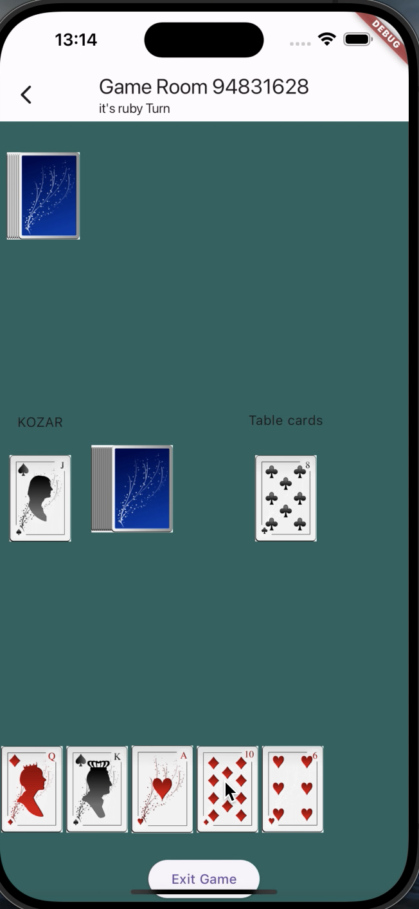

# Durak Multiplayer Game Server

This is the server-side code for a multiplayer game of Durak. It's built with Node.js, Express, and Socket.IO, and uses Firebase Admin SDK for Firestore database operations.

## Features

- Player connection and disconnection handling
- Game room creation and deletion
- Player joining and leaving game rooms
- Game start and end handling
- Card play and table card take handling
- Turn end handling
- Player decision handling for replaying the game

## Setup

1. Clone the repository to your local machine.
2. Navigate to the project directory.
3. Run `npm install` to install the necessary dependencies.
4. You need to provide your own Firebase service account key file (`serviceAccountKey.json`). Place this file in the root directory.
5. Run `node server.js` to start the server.

## API

The server listens for the following Socket.IO events:

- `connection`: Triggered when a new player connects to the server.
- `playerName`: Triggered when a player sends their name.
- `createGameRoom`: Triggered when a player wants to create a new game room.
- `joinGameRoom`: Triggered when a player wants to join an existing game room.
- `leaveGameRoom`: Triggered when a player wants to leave a game room.
- `deleteGameRoom`: Triggered when a player wants to delete a game room.
- `playCard`: Triggered when a player plays a card.
- `takeCardsFromTable`: Triggered when a player takes cards from the table.
- `startGame`: Triggered when a player wants to start a game.
- `playAgain`: Triggered when a player decides whether to play again or not.
- `resumeGame`: Triggered when a player wants to resume a game.
- `endTurn`: Triggered when a player ends their turn.

## Dependencies

- express
- path
- firebase-admin
- socket.io
- socket.io-client

## Contributing

Pull requests are welcome. For major changes, please open an issue first to discuss what you would like to change.

## License

[MIT](https://choosealicense.com/licenses/mit/)

